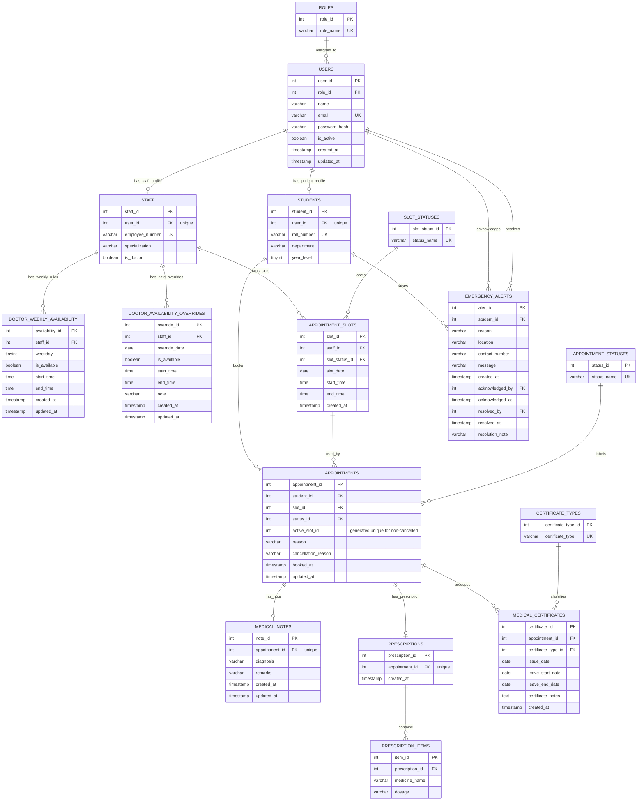

Entity Relationship Diagram

This ERD represents the current MySQL schema for the college infirmary medical appointment system.

Views are not modeled as separate entities because they are derived from the base tables.
Professor, college-staff, and hostel-staff accounts currently use the same patient profile workflow as students while keeping distinct role names in `roles`.

Key Constraints

- `users.email`, `roles.role_name`, status names, certificate type names, roll numbers, and employee numbers are unique.
- `students.user_id` and `staff.user_id` are unique, giving each account at most one patient or staff profile.
- `appointment_slots` are unique by doctor, date, start time, and end time.
- `appointments.active_slot_id` is generated and unique so cancelled appointments release the slot while active appointments cannot double-book it.
- `medical_notes.appointment_id` and `prescriptions.appointment_id` are unique, making each appointment have at most one note and one prescription.
- `medical_certificates` are unique by appointment and certificate type.
- Doctor availability has one weekly rule per doctor and weekday, plus one override per doctor and date.
